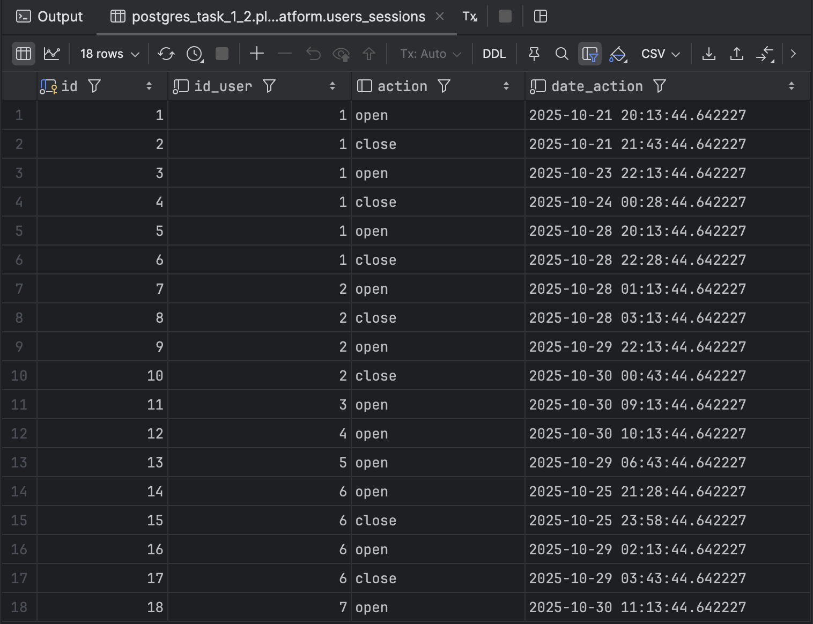
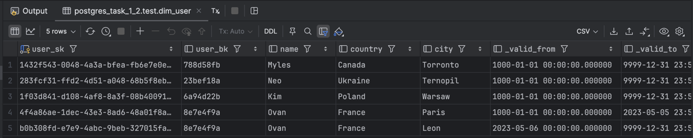

# Data Engineering Test Task

This repository contains the solutions for the data engineering test task. The project is divided into three parts:

1.  **Task 1:** A SQL query to calculate user session durations.
2.  **Task 2:** A SQL script to implement Slowly Changing Dimensions (SCD) logic.
3.  **Task 3:** An Airflow ETL pipeline to ingest currency exchange rates into a GCS Data Lake.

---

## Project Structure

The repository is organized as a complete data project, including SQL tasks and a fully operational Airflow environment.
```.txt
.
├── dags/
│   └── dag_currency_etl.py     # main Airflow DAG file.
├── plugins/
│   └── helpers/
│       ├── __init__.py
│       └── constants.py
├── sql_tasks/
│   ├── task_1_ddl_insert.sql   # DDL/DML for local testing of Task 1
│   ├── task_1_psql.sql         # Task 1 solution (PostgreSQL syntax)
│   ├── task_1_bigquery.sql     # Task 1 solution (BigQuery syntax)
│   ├── task_2_psql.sql         # Task 2 solution (PostgreSQL syntax)
│   └── task_2_bigquery.sql     # Task 2 solution (BigQuery syntax)
├── .env                        # Local configuration
├── .gitignore
├── docker-compose.yaml         # Defines the Airflow services (scheduler, webserver, additional psql DB, etc.)
├── gcp_key.json                # (NOT COMMITTED) GCP service account key
├── .pre-commit-config.yaml
├── pyproject.toml
└── README.md                   # This file
```

---

## Task 1: SQL - User Session Calculation

This query calculates the total time spent per user per day over the last 10 days.

### Logic

The query uses a `LEAD` window function to find the `close` action corresponding to each `open` action, partitioning by `id_user`

### SQL Dialects

For this task, I have provided two syntax variations:

* **`sql_tasks/task_1_psql.sql`**: A version compatible with **PostgreSQL** for local testing. It uses `CURRENT_DATE - INTERVAL '9 days'` and `EXTRACT(EPOCH FROM ...)` for time calculations.
* **`sql_tasks/task_1_bigquery.sql`**: A production-ready version for **Google BigQuery**, using `DATE_SUB(CURRENT_DATE(), ...)` and `TIMESTAMP_DIFF(...)`.
* **`sql_tasks/task_1_ddl_insert.sql`**: Contains the DDL and DML to create and populate tables in a local PostgreSQL database for testing.

### Local Execution Result (PostgreSQL)
Raw data

Queried data

---

## Task 2: SQL - SCD Type 1 & Type 2

This script correctly merges a new batch of user data from a staging table (`stg_user`) into a dimension table (`dim_user`), handling two types of Slowly Changing Dimensions (SCD):

* **SCD Type 1 (Name):** The `name` attribute is overwritten on change.
* **SCD Type 2 (Country, City):** Changes to `country` or `city` result in the old record being expired (`_valid_to = NOW()`) and a new record being inserted.


### SQL Dialects

* **`sql_tasks/task_2_psql.sql`**: A solution for **PostgreSQL** that uses a `MERGE` statement and a subsequent `INSERT ... LEFT JOIN` to achieve the SCD logic.
* **`sql_tasks/task_2_bigquery.sql`**: A solution for **BigQuery**, which also uses a `MERGE` statement followed by an `INSERT` to handle all cases robustly.

### Local Execution Result (PostgreSQL)

Raw Data

test.dim_user

test.stg_user

Ingesting result


### Execution Result (BigQuery)
All steps

Ingesting result


---

## Task 3: Airflow ETL - Currency Rates Pipeline

This is a production-ready ETL pipeline built with Apache Airflow 2.x. It extracts daily currency exchange rates (starting from July 1, 2025), transforms them, and loads them into a Google Cloud Storage (GCS) bucket as partitioned Parquet files.

### How to Run

1.  **GCP Setup:**
    * Create a GCS bucket (e.g., `currency-rate-data`).
    * Create a GCP Service Account.
    * Grant this Service Account the **"Storage Object Admin"** role on your bucket.
    * Download the JSON key file and save it as `gcp_key.json` in the root of this project.

2.  **Configuration:**
    * Create a `.env` file in the project root. (A `.gitignore` file is included to protect this file and `gcp_key.json`).
    * Populate it with the following:
        ```.env
        # -- Airflow Core --
        AIRFLOW_UID=50000
        AIRFLOW_IMAGE_NAME=apache/airflow:2.10.5-python3.12

        # -- Airflow Packages --
        _PIP_ADDITIONAL_REQUIREMENTS=pandas pyarrow requests apache-airflow-providers-google gcsfs

        # -- DAG Variables --
        # (These will be automatically loaded into Airflow)
        AIRFLOW_VAR_BASE_CURRENCY=USD
        AIRFLOW_VAR_OUTPUT_PATH=gs://<YOUR_BUCKET_NAME_HERE>
        ```

3.  **Launch Airflow:**
    ```bash
    docker compose up -d
    ```

4.  **Run the DAG:**
    * Open the Airflow UI at `http://localhost:8080` (login: `airflow` / `airflow`).
    * Find the `currency_rates_etl` DAG and **un-pause** it.
    * Airflow's scheduler will see `start_date=2025-07-01` and `catchup=True` and will **automatically create and run** one DAG run for every day from that date until today.

### Features(based on assumptions)

* **Idempotent:** Each DAG run is responsible for only one day (`logical_date`). Rerunning it for a specific day will simply overwrite that day's data.
* **Resilient:** The `extract` task will retry 5 times on network failures.
* **Configurable:** Key business logic (base currency, output path) is controlled via Airflow Variables for easy changes without touching code.
* **Data Lake Ready:** The pipeline writes data in a Hive-partitioned structure (`base_currency=USD/date=YYYY-MM-DD/`).

### Pipeline Design Notes

#### 1. API Selection

The choice of `frankfurter.app` was deliberate after investigating several alternatives that were unsuitable:

* **`openexchangerates.org`:** The free tier does not support historical data, which was a core requirement for the backfill.
* **`exchangeratesapi.io`:** The free tier is limited to 100 calls/month. Our historical backfill (July 1 - Oct 30) alone requires ~120 calls, making this API unsuitable.
* **`frankfurter.app` (Final Choice):** This API is free, requires no key, and is backed by reliable European Central Bank (ECB) data, making it the ideal choice.

#### 2. Note on Currency Scope

The original task required the ability to convert *any* currency. It's important to note that the chosen API (`frankfurter.app`), being based on the European Central Bank, does not provide data for all global currencies. It returns rates for a specific subset of approximately 30 major world currencies (USD, JPY, GBP, AUD, CAD, etc.).

#### 3. Note on Data Freshness (ECB Data)

A key finding during development was that requests for non-business days (weekends or holidays) return data from the previous business day. For example, a request for `2025-07-06` (a Sunday) returns data from `2025-07-04` (Friday).


This is **expected behavior** and not a bug. The European Central Bank (the source) only publishes rates on business days.


### DAGs run result
Airflow

GCS

